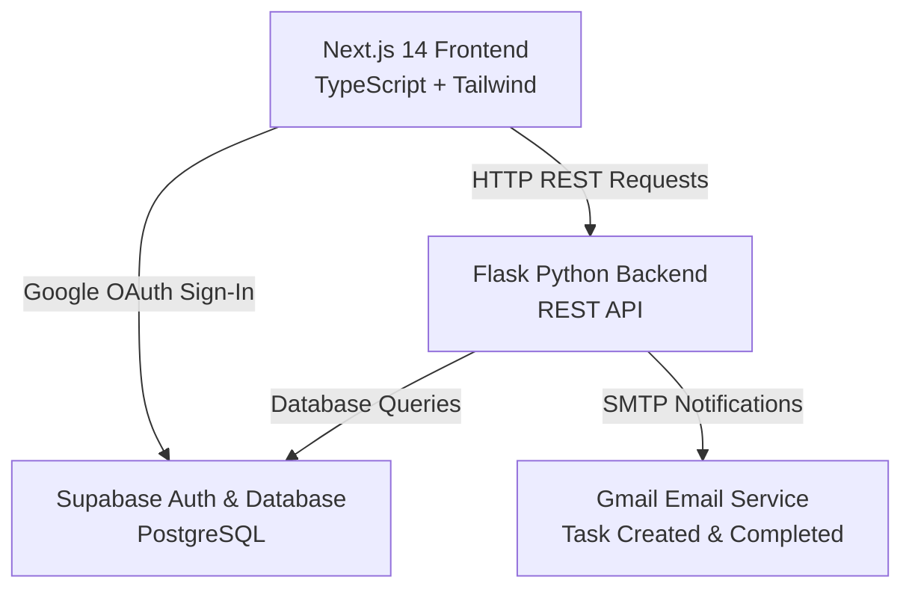

# 🚀 Collaborative Task Management System

A full-stack, enterprise-grade Task Management Web Application built with **Next.js 14 (TypeScript)**, **Flask (Python)**, **Supabase (PostgreSQL Database & Auth)**, **Google OAuth 2.0**, and **Gmail SMTP Email Notifications**.

---

## 📐 System Architecture

The application follows a clean, decoupled microservices-ready architecture:



### Key Architectural Flows

1. **Authentication Flow (Google OAuth 2.0)**:
   - Users authenticate with their Gmail account via Supabase Auth Google Provider.
   - Upon successful sign-in, a Postgres trigger automatically creates/updates the user's profile record in the `public.profiles` table.
   - The frontend synchronizes the session token with the Flask backend.

2. **Task Creation & Assignee Email Notification**:
   - When a user creates a task and assigns it to a collaborator, the frontend sends a `POST /api/tasks` request to the Flask API.
   - Flask validates the task data, inserts the record into Supabase, and triggers `EmailService` asynchronously via a background thread.
   - An HTML notification email is sent to the assignee's Gmail account detailing task title, description, priority, and due date.

3. **Task Completion Email Notification**:
   - When a task's status is toggled to `completed`, Flask intercepts the transition and dispatches completion emails to both the task creator and assignee.

---

## 🛠️ Technology Stack

| Layer | Technology Used |
| :--- | :--- |
| **Frontend** | Next.js 14 (App Router), TypeScript, Tailwind CSS, Lucide Icons, Date-fns |
| **Backend** | Python 3.12, Flask, Flask-CORS, Gunicorn, `smtplib` |
| **Database** | Supabase PostgreSQL, SQL Migrations, Row Level Security (RLS) |
| **Authentication** | Google OAuth 2.0 via Supabase Auth |
| **Email Service** | Gmail SMTP Server (`smtp.gmail.com:587`) |
| **Deployment** | Vercel (Frontend), Render / Railway (Backend), Supabase (Database) |

---

## 📁 Repository Structure

```
task-manager/
├── migrations/
│   └── 01_initial_schema.sql         # Supabase PostgreSQL DDL, triggers & RLS policies
├── backend/
│   ├── app.py                        # Main Flask application entrypoint & CORS config
│   ├── config.py                     # Environment & app configuration settings
│   ├── requirements.txt              # Python package dependencies
│   ├── Dockerfile                    # Containerization build manifest
│   ├── render.yaml                   # Render deployment configuration
│   ├── Procfile                      # Gunicorn start process definition
│   ├── .env.example                  # Backend environment template
│   ├── routes/
│   │   ├── auth.py                   # Auth & profile sync routes
│   │   ├── tasks.py                  # Task CRUD & email trigger logic
│   │   ├── users.py                  # User listing for task assignment
│   │   ├── comments.py               # Task discussion comment routes
│   │   └── analytics.py              # Metrics & dashboard stats
│   └── services/
│       ├── supabase_service.py       # Supabase database service wrapper
│       └── email_service.py          # Asynchronous Gmail SMTP dispatcher
├── frontend/
│   ├── package.json                  # Next.js & npm package configuration
│   ├── tsconfig.json                 # TypeScript compiler configuration
│   ├── tailwind.config.js            # Tailwind styling setup
│   ├── vercel.json                   # Vercel deployment manifest
│   ├── .env.example                  # Frontend environment template
│   └── src/
│       ├── app/
│       │   ├── layout.tsx            # Root HTML layout
│       │   ├── page.tsx              # Auth router redirector
│       │   ├── login/page.tsx        # Google OAuth & Demo sign-in screen
│       │   └── dashboard/page.tsx    # Main task management dashboard
│       ├── components/
│       │   ├── Navbar.tsx            # Top header navigation & profile
│       │   ├── AnalyticsCards.tsx    # Dashboard overview stat widgets
│       │   ├── TaskCard.tsx          # Task card item with quick actions
│       │   ├── CreateTaskModal.tsx   # Modal form to create/assign tasks
│       │   ├── EditTaskModal.tsx     # Modal form to update task details
│       │   └── TaskDetailModal.tsx   # Modal view with discussion comments
│       └── lib/
│           ├── supabaseClient.ts     # Supabase browser authentication client
│           └── api.ts                # Type-safe API client for Flask REST API
└── .env.example                      # Root environment variables template
```

---

## 🔍 Detailed Code & Module Walkthrough (Interview Reference)

### 1. Database Schema & Supabase Setup (`/migrations/01_initial_schema.sql`)
- **`profiles` table**: Stores Google user metadata (`id`, `email`, `full_name`, `avatar_url`).
- **`tasks` table**: Stores core task attributes (`id`, `title`, `description`, `status`, `priority`, `due_date`, `created_by`, `assigned_to`).
- **`task_comments` table**: Enables task-level discussions between team members.
- **Triggers**:
  - `handle_new_user()`: Automatically listens to Supabase `auth.users` inserts and syncs profile data into `public.profiles`.
  - `update_updated_at_column()`: Automatically maintains accurate `updated_at` timestamps on modified task records.

### 2. Flask REST Backend (`/backend`)
- **`services/email_service.py`**:
  - Encapsulates Gmail SMTP protocol setup using TLS on port 587.
  - Spawns background threads (`threading.Thread`) for non-blocking email dispatch.
  - Renders custom HTML templates for "Task Created & Assigned" and "Task Completed" notifications.
- **`services/supabase_service.py`**:
  - Provides a single point of data access to Supabase via `supabase-py`.
  - Joins task queries with creator and assignee profile records for efficient single-query loading.
- **`routes/tasks.py`**:
  - Handles filtering by status, priority, assignee, creator, and text search.
  - Intercepts state changes to trigger email notifications seamlessly.

### 3. Next.js Frontend (`/frontend`)
- **`src/app/login/page.tsx`**: Features dual authentication support: Google OAuth 2.0 via Supabase and Quick Demo Sign-In for instant evaluation.
- **`src/app/dashboard/page.tsx`**: Responsive dashboard with real-time state updates, tabbed filtering ("All Tasks", "Assigned to Me", "Created by Me", "Completed"), search bar, and modal management.
- **`src/lib/api.ts`**: Centralized TypeScript service for making typed HTTP requests to Flask API endpoints.

---

## 🚀 Local Installation & Setup Guide

### Step 1: Database Migration (Supabase)
1. Log into your [Supabase Console](https://supabase.com/).
2. Open **SQL Editor** -> **New Query**.
3. Copy the contents of [`migrations/01_initial_schema.sql`](file:///C:/Users/dasar/task-manager/migrations/01_initial_schema.sql) and click **Run**.

### Step 2: Backend Setup (Flask)
```bash
cd backend

# Create virtual environment
python -m venv venv
# Activate on Windows:
venv\Scripts\activate

# Install dependencies
pip install -r requirements.txt

# Create .env from template
cp .env.example .env
# Fill in your SUPABASE_URL, SUPABASE_KEY, GMAIL_USER, and GMAIL_APP_PASSWORD

# Start Flask server
python app.py
```
*Backend API will run on `http://localhost:5000`.*

### Step 3: Frontend Setup (Next.js)
```bash
cd frontend

# Install npm packages
npm install

# Create .env.local from template
cp .env.example .env.local
# Fill in NEXT_PUBLIC_SUPABASE_URL and NEXT_PUBLIC_SUPABASE_ANON_KEY

# Start Next.js dev server
npm run dev
```
*Frontend application will run on `http://localhost:3000`.*

---

## 🌐 Production Deployment Guide

### 1. Deploy Frontend to Vercel
1. Push project to GitHub repository.
2. Import project into Vercel and set Root Directory to `frontend`.
3. Add Environment Variables:
   - `NEXT_PUBLIC_SUPABASE_URL`
   - `NEXT_PUBLIC_SUPABASE_ANON_KEY`
   - `NEXT_PUBLIC_API_BASE_URL` (Points to deployed Flask backend URL)
4. Click **Deploy**.

### 2. Deploy Backend to Render / Railway
1. Create a new Web Service on Render / Railway pointing to your repository.
2. Set Root Directory to `backend`.
3. Build Command: `pip install -r requirements.txt`
4. Start Command: `gunicorn app:app`
5. Add Environment Variables:
   - `SUPABASE_URL`
   - `SUPABASE_KEY`
   - `GMAIL_USER`
   - `GMAIL_APP_PASSWORD`
   - `FRONTEND_URL` (Points to deployed Vercel frontend URL)

---

## ⚡ Added Business Value Features (Bonus Points)
- **Task Discussion Feed**: Team members can post comments and updates directly on task items.
- **Metrics Dashboard**: Visual cards showing Total, Pending, In Progress, and Completed tasks.
- **Multi-Criteria Filter & Instant Search**: Filter tasks dynamically by priority, status, assignee, or keyword search.
- **Overdue Indicator**: Visual badges highlighting tasks that have passed their target due date.
